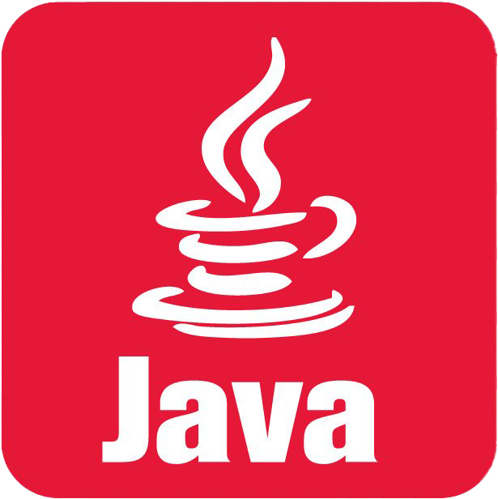

 

    

  <h2 align="center">An Object Oriented Programming Project</h2>

  

    A software to manage warehouse system by using Java and MySQL
     
     
    <a href="#overview">Overview</a>
    ·
    <a href="#demo">View Demo</a>
    ·
    <a href="#libraries">Libraries</a>
  

## Overview
![program-screenshot-1]
 

<strong>This program is the project from Object Oriented Programming subject</strong>
 
this program created by thinking about how system of warehouses works and have a friendly UI/UX for user
and this program use JDK 15 and MySQL to stored all data and information about user to bring more user-experienced

## Demo

[program-screenshot-1]: src/imgs/program_screenshot_1.PNG